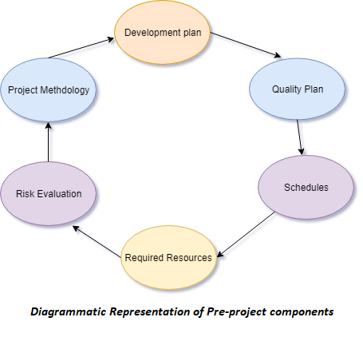

# SOFTWARE TESTING

## SOFTWARE FUNCTIONAL QUALITY

it reflects how well it satisfies a given design,
based on the functinoal requirements or specifications

## SOFTWARE STRUCTURAL QUALITY

deals with the handling of **non-functional requirements** that
support the delivevry of the functional requirements, such as
robustness - maintainability, 
degree of the software was produced correctly

## IEEE DEFINITION

1. The degree to which a system, component, or proecess meets specified
   requirements(set by customer or user )

## SOFTWARE QUALITY OBJECTIVES

1. CLEAR GOALS
1. PRIORITIZATION
    1. focus on critical
1. MEASUABLE SUCCESS
    1. track progress
1. CUSTOMER SATISFACATION
    - meet user needs

### Examples of software quality objectives

1. FUNCTIONALITY
1. RELIABILITY
1. PERFORMANCE
1. USABILITY
1. SECURITY
1. MAINTAINABILITY

### settings and measuing software quality objectives

- ALIGN WITH REQUIREMENTS
- QUANTIFIABLE METRICS
- PRIORITIZAITON
- COMMUNICATION AND REVIEW

## SOFTWARE QUALITY CHALLENGES

1. Defining quality standards
1. Testing and quality assurance
1. managing complexity
1. continuous integration and delivery
1. user experience and satisfaction
1. security and privacy
1. maintenance and scalability

### why

1. Intangibility
1. Complexity
1. Evolving requirements
1. Human factors
1. security threats

### strategies for addressing the software quality challenges

1. formalized quality management
1. agile development and testing
1. test automation
1. focus on user experience
1. code reviews and pair programming
1. devops practices

### software quality factors

- product operation
    - correctness
    - reliability
    - efficiency
    - usability
    - security
- prodcut revision
    - maintainablity
    - flexibility
    - testablity
- product transition
    - portability
    - reusability
    - interoperability

### importance of software quality factors

- enhanced user experience
- reduced costs
- improved market competitiveness
- efficient development process

## components of sqa(software quality assurance) system

**Software Quality Assurance (SQA)** is a set of activities for ensuring quality in software
engineering processes. It ensures that developed software meets and complies with the
defined or standardized quality specifications. SQA is an ongoing process within the
Software Development Life Cycle (SDLC) that routinely checks the developed software to
ensure it meets the desired quality measures.

### includes

1. process defiintion and implementation
1. auditing
1. training
1. software development methodology
1. project management
1. configuration management
1. requirements development management
1. estimation
1. software design
1. testing
1. identify weakness in the process
1. correct theose weakness

## project lifecycle

1. development stage
1. operation maintenance stage
1. components of infrastructre error prevention and improvement
    1. Procedure and work instructions
    1. Templates and Checklists
    1. Staff Training, Retainingand Certification
    1. Preventive and Corrective Actions
    1. Configuration Management
    1. documentation control
1. components of software quality management
    1. Project Progress Control
    1. Software Quality Metrics
    1. Software Quality Costs
5. components of standardization, certification and sqa system assesment
1. organizing for sqa - the human components

