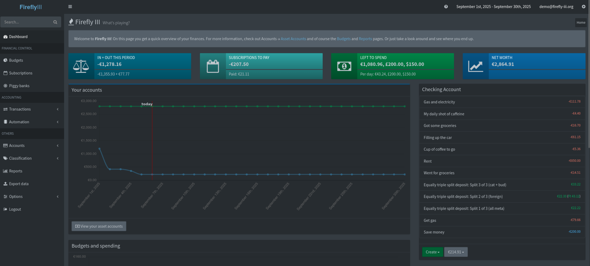

# Life After College

It's been around 6 months since I have completed my college. So many memories
were made there. So, many dreams were had. Now facing reality makes me question
why people want to do this. I mean as a society we have advanced enough that we
should just find ways to let Robots take over all the backbreaking work and we
should just enjoy our time on Earth

I guess I am just having the existential crisis that most people have right
after they leave college. The first few months were awesome. I woke up and did
thing I liked. No more waking up early to catch the bus, No more trying to do
assignments on time, not like I did any during college it just feels good to
enjoy when you have nothing lined up to do. No more things that you can ignore
and reap the consequences of. Then a thought hits suddenly, No more academic
consequences. Which means no more adult ~guiding~ ordering you to do something.

> You are on your own
>
> -- me

In all sense this is freedom. The freedom to do whatever you want. Purse what
you love to the world's end. Which also means the consequences aren't you
getting a lower grade. This time around it means you don't know what the
consequences. Which for me meant I needed to manage my finances. No more relying
on parents. I guess if you live your life mine I do. There will be moment of
realization after you spend your first month salary and check bank balance. 

> "Who stole my money"
>
> -- me

The answer was I did. When given freedom to shoot your own foot. You shoot it a
lot of times and part of fun being a young adult trying to figure these things
on my own.

So, if you came across this weird blog, here are some of my findings I had after
I became an young adult.

> [!CAUTION]
>
> If you are the kind of person to read and believe and do whatever
> You see on the internet that means you are an idiot and I am not 
> responsible for idiots. DO NOT TAKE THIS AS ADVICE
>
> -- word of caution.

## USE FINANCE BUDGETING SOFTWARE

There are like a lot of budgeting software out there. Use them. Install a couple
and try them out. See what works for you. For some Excel or just writing them
down in a notes or a account book will do. For me I am self-hosting
[fireflyiii](https://www.firefly-iii.org/) and on my phone I am using
[waterfly-iii](https://github.com/dreautall/waterfly-iii). Honestly one of the best ways to manage 
my finances.

So, whatever software or way your noting them
down. The **important point** is to **NOTE** them down. Make it a habit every
day at the end enter how much you have spent on that day and calculate if what
you had from ***yesterday - what you spent today = what you have now***

This gave a lot of insights into how much I spent on food and other things. I
was kinda surprised I was spending this much on things. This will help you
budget for things you wanna save up for.

## REALLY HARD TO KEEP IN TOUCH WITH FRIENDS

When you start your first job. Suddenly, all the time you have will sink into
that. You can't just skip work like you used to skip school/college. 
You suddenly go from seeing your best friend everyday at college and hanging out
all the times. To ones or twice a month and the logistics to find a day where
everyone is free become a hell. Especially when everyone goes somewhere else for
work or other reasons. 
Kids (I feel sooo... old lol), try to hang out with your friends cause one day you
gonna wake up and realise it's damn near impossible for everyone to come
together. If you have the chance to hangout you say 'yes'. Cause the great one
have said

> “Whatever you do in this life, it’s not legendary unless your friends 
> are there to see it.”
>
> -- Barney Stinson

> "Life can be good by yourself. But, like everything else, the best 
> experiences are always the ones you share with others."
>
> -- random greek knowledge I found on the internet

Suddenly you will be left with 4 or 5 people you talk on a regular.
You still have the internet to keep in connection with others. Even if some
leave for USA without you (Good luck on your MBA and Masters peeps ).

## BRAIN ROT

**STOP USING PHONES.
BRAIN ROT IS REAL**

## FAILED DREAMS

The side project you swear you were gonna finish before final year. The side
hustle you wanted to start so you can see some income. The company you wanted to
create. For most people it dies here. Yeah...
You really have to push yourself and manage your time in a day to pursue what
you like. Because all your energy would be spent on work and the rest you gonna
have to rest or straight to burnout it is.

## WFH (Work From Home) vs WFO (Work From Office)

If you have the privilege  to work from home. Always choose work from home.
No time wasted on travel. You can finish your work without being distracted or
getting tired just from the travel. The most importantly if you work properly
and finish tasks on time. You work just 8 hours and not more.

|               | WFO       | WFH                 |
|---------------|-----------|---------------------|
| TRAVEL to&fro | 1 hr ~ 2 hr | 1 min (bed to desk) |
| WORK          | 8 hr        | 8 hr                |
| LUNCH         | 1 hr      | 1 hr                |
| TOTAL         | 10 hr ~ 11hr      | 9.1hr               |

And not to mention how much tired you get by just travelling in the heat. The
laundry you have to do because you need to wear work attire.

## SOMETHING'S AREN'T MEANT TO BE FOREVER

Well you are bound to do some stupid shit that makes you lose certain things.
You are gonna wish you did something different. Learn from your mistakes. Beat
yourself up a little bit but don't forget to ever let it happen again. Certain
things are worth more than money and career. Don't be an idiot. All you can do
is learn and try to move on. If you are feeling down eat a lot of
cheesecake(Lafayette) and Ice Cream(ibacco cotton candy and bubblegum). 

## WORKOUT

I have put on a lot of weight after I finished college. Mainly due to sitting in
a single place. Been meaning to work out properly. Been lazy. So, this is one of
the **'Do as I and not as I do'** things. Go to Gym, maintain your health.
Be cautious of what you eat. Your metabolism ain't gonna be like as when you
were growing up.

## HAVE FUN

I have been always interested in ancient philosophers and their saying. The
teaching of different school of thoughts have been very helpful in my life.
Especially the stoic ones. While I am more interested in stoic philosophy (btw i
do not mean the cringy tiktok/reel/yt-shorts and those motivational channels).
The philosophy of Nihilism is also pretty good. As far as I am concerned we are
in a small rock in the vast space going around in a very hot star and if there
is a bigger meaning out there. We are too small of a significance to worry too
much about it. Think about it whatever you are feeling right now. However
depressed you may get. Just pull your head out of your ass and think about how
the vast the fucking universe is. The limitless rocks out there and we are in
this one and we are just an anomaly in this. Our existence has no significance.
It's kinda relieving that whatever we do has no greater effect on the cosmos.

Just try to Make the best out of what you are handed. If by any chance you are
reading this. Which means you have internet, a phone/pc be grateful for that.

> Whatever happens happens\.\.\.
>
> -- space cowboy
