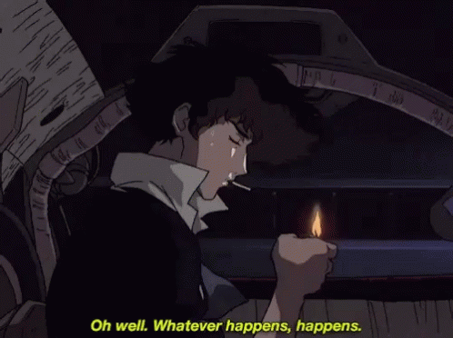

--- 
title: "What Do We Live for ? 20 years old and down low" 
date: 2024-03-29T17:27:18+05:30 
author: "RAXEN" 
draft: false 
customcss: "blog.css" 
---

# What do we live for ?

As i am entering my adulthood. One question remains in my head all the time.
What do we live for ? What's the bloody point of living in this Earth. What are
we here for ? To work a 9 - 5 job work ourselves to death or to explore the
Earth Whatever answer i arrive in the end whatever school of Philosophy i try
to learn be it Nihilism or Stoichism in the end I never could find the one that
suits me the most. I just wanna take a step back and re-live my childhood. The
pressure free, no  part of our lives.

## Childhood expectations of adults

Everyone in their childhood looked up to their parents and saw a perfect
functions woman / man able to provide value to their society. Then as you grew
up you begin to find cracks in your rose coloured lenses. They aren't as
perfect as you thought they were. They make mistakes to. They own up to them.
They sometimes do dumb shit. They are just like us but with more experience. 

## Reality of entering adulthood

20 years is the age where it hits you that lives been moving a faster than you
can handle. Suddenly you aren't a kid anymore, You ain't living with your
parents anymore, You have to manage the money you spend, You have to decide
what you are gonna do with your life. Suddenly you gain freedom to do anything
you ever wanted. Want to hangout with your friends 3am midnight sure go for it.
And you are gonna fumble a lot. You gonna make some mistakes. And the best
parts are the mistakes. I once heard a quote from freedom in a Linux forum.
True freedom is to dumb shit. Be it removing your system or bricking your
hardware. The ability to do those stuff is freedom and Life in a sense is like
that. You have the power in your hand to do some dumb shit that can ruin your
life and on the contrary you can build your life up. 

My life's been a roller-coaster. I lived with my life up till now with no
regrets. Yet there were sometimes i felt like i could have done better. Once
you start to understand how things work you obviously think you could have done
it better the first time but trust me the mistakes make you who you are. Learn
from them. To summarize my college life so far. I have learnt a lot about
people than ever before I learnt a lot of things in life. That no book could
have taught me. There's no tutorial to life.

> "You Live your life your way. You are writing your autobiography now."
>
> \- Me                                               

College is gonna teach you a lot of things passively. Things like if you wanna
do something You gotta do it. You can't wait for someone else to start and you
can join later. 

You wanna create a club. Go get permissions. Gather like minded people. Do
crazy shit !!! Want to take workshops. Tell it to people with similar
interests. Find people interested in workshops and make that happen.

In college you gonna be bombarded people that are very talented, people that
are very lucky. At one point you gonna feel like you don't belong there. People
will be having their own company. People will have their life figured out. What
they gonna do ? What they will be ? Who they gonna marry ? But trust me __THEY
DON'T__. It may sound insane. How can people who have their own company. Their
own life planned out still haven't figured out life. The cold hard truth is
everyone around is going through the same stuff They are too trying to fit in
this world. Trying to find where they belong. Family pressure to earn money.
Peer pressure to hangout. Everyone has something they are dealing with.

When you look around you see all these people battling their own fights. Trying
climb their own mountains. However small or big may they seem in the end
everyone is going through something. No one has this shit figured out. Everyone
is making it up along as they go. Maybe you will see someone who make you feel
like they has their shit together. Believe if you spend 5 minutes talking to
them on a personal level they too will be clueless.

Why ? Because every ones goal in life is different. For some to succeed is to
have a high paying job with job security and pension. For some it is to get
rich quick. For others is being a patriot and providing support to our country.
For some it is being a wanderer to go wherever they want when ever they want.

___It's all right. You don't need to have it all figured out. You are just
20___

## Personal struggles

Its is not easy to wake up everyday trying to figure out what you wanna do with
your life When all your life you wanted to be something different each day.
Suddenly you have picked a career you have to pursue for the better part of
your life is hard. Sometimes you question if you have made the right decision.
Computer science was my passion and i made the decision to study it as my
career and even then there are sometimes i think to myself. Maybe there was
something else i was better suited to do. 

Each day you try to better yourself a small step at a time. Maybe seem
insignificant for a day's progression. But trust me small changes each day
compounds overtime and lasts a long time. You won't see the results for months,
years but have trust in the process keep grinding those Leetcode, keep doing
the projects. Keep in mind. It doesn't matter in the end if you ain't enjoying
it. Don't fall into the brain rots that is the social media those short term
dopamine rush you get ain't worth it.

## What got me addicted to computer

### ___THE RUSH___

The rush you get when you break your brain on a problem for hours. Never quite
figuring out how to solve it. When you finally give up and go to sleep and
suddenly your brain turn on God mode and everything you couldn't understand now
you could understand perfectly. When you can formulate a procedure to solve the
problem as the rush of adrenaline wakes you up from sleep As you code the
fucking solution. As you see the results. As you finally figure it out. The
fucking rush is what made me choose computer science

The first time i pwned a system. The first time i cracked my WiFi password. The
first time i reverse engineered my school API. The fucking rush i felt. That
what encouraged me. The rush you get when you spend 10+hours staring at your
screen unable to figure out how to solve it. Then when it all comes together.
That rush is what i live for.

## Enjoy while it lasts cause it won't stop and wait for anyone...

It's okay to take a step back and enjoy the little moments in life. You gonna
meet a lot of people some will stay with you. Some want to see you succeed.
Some want to see you fail. Some will go. Some will change.

### BestFriendsForever

I won't ever forget my college friendships I had. It was one of the most eye
opening things I ever experienced in my life. You sleep in the same room, have
the same friend group be together 24/7. You feel like you know the person and
you find out They aren't. One of the most perspective changing experience i
ever had. I can't go more into details but yeah some of the friends I met are
helping me reach higher places. Encouraging each other. Some I had to cut out
from my life for my betterment. Some I Would have never guessed would have
turned out to be like this. Sometimes i wish i could stay ignorant to all the
things that is happening around me. Sometimes i wish i could turn a blind eye
and be happy with my friends but i can't. I have to make a decision and stick
to it. Sometimes you shouldn't be afraid to cut people out of your lives even
the ones that are most closest to you. The ones you thought you will have
besides you in your dying moments. Sometimes life just wants to fuck with you.
They ain't gonna last. 

You will find people that you wanna be in your life, Good people. Once you do
You hold onto them and never let them go. Once you learn how easy it is in life
to part away from people. You may never want to let people go

### Small moments

A lot of life altering things in life doesn't happen in a grand manner there
isn't gonna be a red or blue pill. It is going to be mundane things. An Yes/No,
right place at the right time. That's all it is needed for your life to change.

# End thought ## Whatever happens happens...

In the end of the day you have control over nothing that i what it means to
live. Accept the fact that you can't control anything only then you can do
anything. Maybe today's is just a bad day. Fuck it then try again tomorrow.

### For what my purpose in life is

I don't really know. Maybe it is to enjoy, maybe it is not. Yeah life might get
hard sometimes. I may not achieve my dreams. I may not always get what i want
and it is Alright. As long as i am having fun i don't care. I wanna enjoy what
i do. I not am the kind of person who can sit in a cubicle with a job i hate. If i
do something it have to enjoy doing it. I can't force myself to do something i
don't like. I was never able to and never will be able to. Maybe life gets so
hard i might not be able to the same point of view as i am having today. Well
that's just life. You can't do nothing about it. You can't fight it. You can't
anticipate what is gonna happen today. There isn't any rules to this mess. It's
all just chaos and there's beauty in it. 

#### I don't know what I am doing and I am okay with it. You don't need to know
#### everything and live perfectly. I just want do some cool shit

As once the great Spike Spiegel said

> "Whatever happens happens..."
>
> \- Spike Spiegel

