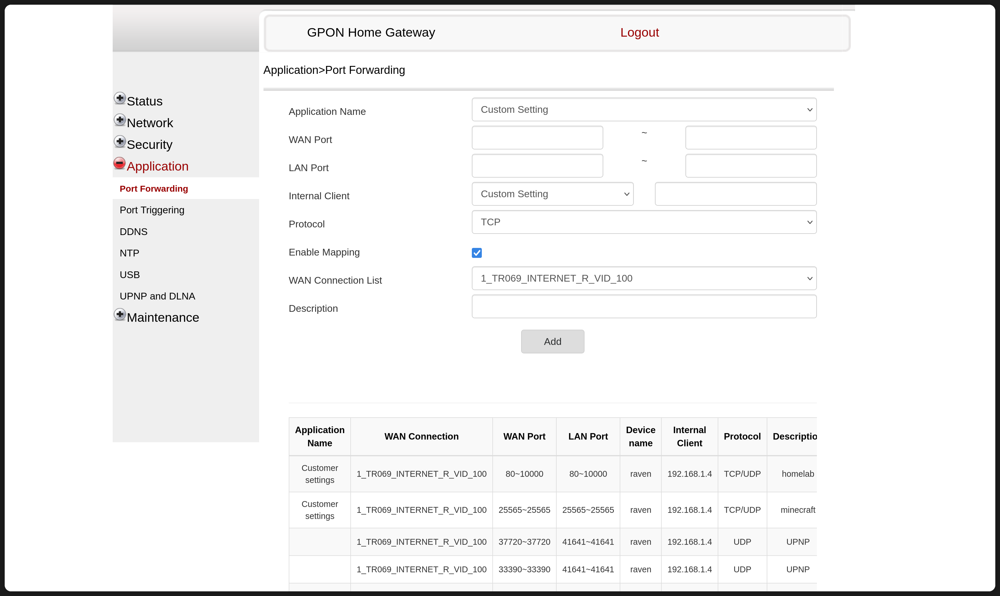
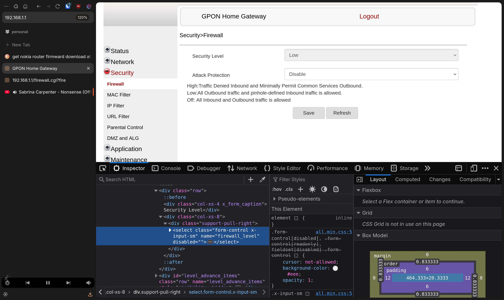
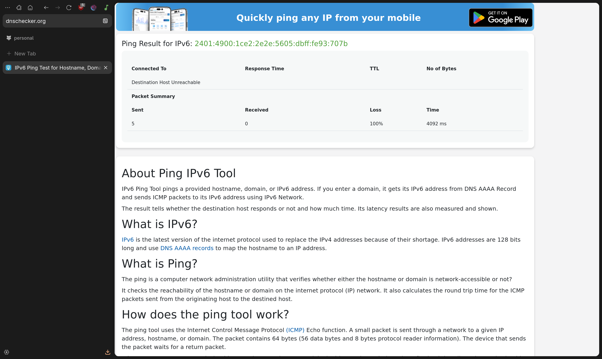
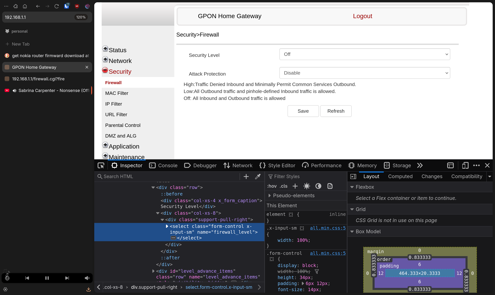
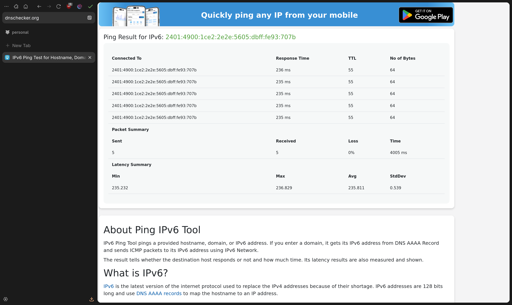

# HOW TO BYPASS AIRTEL NOKIA G-2425-A LOCKED DOWN SETTINGS (FEW OF THEM)

**Airtel & Nokia has locked down the router. Almost every known exploit has been patched.
This guide won't be about getting root level access to the router. While that is
my end goal. I haven't achieved it yet.**

## INTENTION

### IPV4

I wanted to setup my homelab server. Everything was going good. I didn't have my
IPV4 behind CGNAT somehow and thanks to that I could use dynamic IP with
namecheap using the ddclient and have my server accessible from everywhere. 

With a bit of portforwarding, I could access my home server from virtually
anywhere and it was perfect.

### IPV6

Common knowledge is that IPV6 is unique to every device hence making it the best
option if your IPV4 is behind CGNAT or some situation like that. I used to use
IPV6 to host my home lab before. But Airtel seemed to have been filtering even
the icmp data coming via IPV6. 

The solution seemed simple try disabling the router firewall and check if ipv6
is reachable. 

> **CAUTION**: 
> DO NOT DISABLE FIREWALL IF YOU DON'T KNOW WHAT YOU ARE DOING

## RANT ABOUT AIRTEL CUSTOM SUPPORT

But it wasn't behold AIRTEL locking down every settings that I might find
useful. The Airtel customer support was pretty useless and didn't understand
what I wanted.

# NOTES

airtel rant
add images how to do it
add instructions
only works for firewall

images

