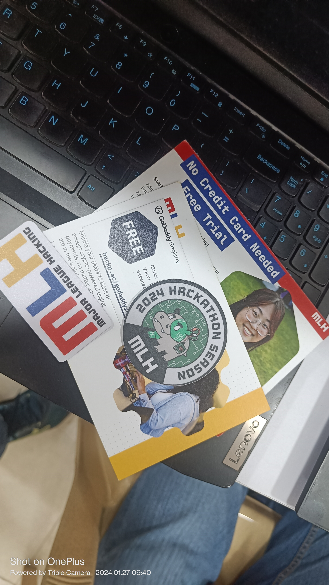
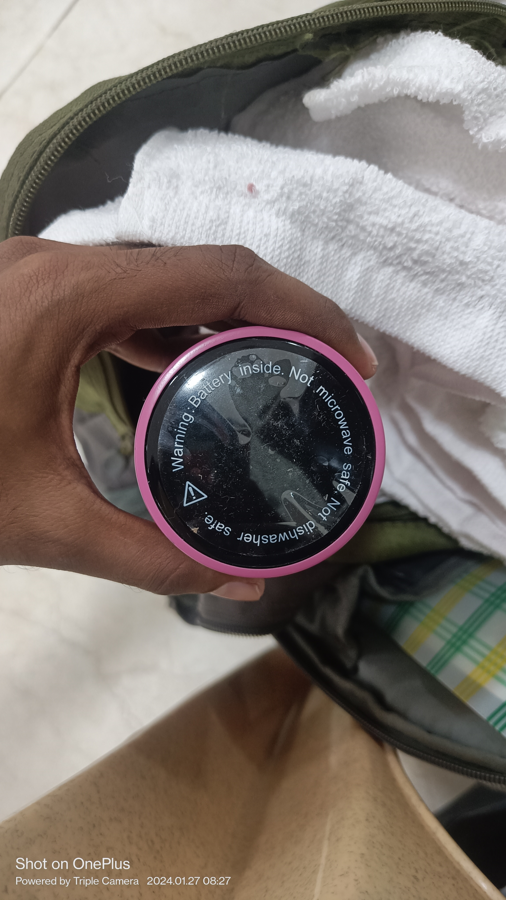
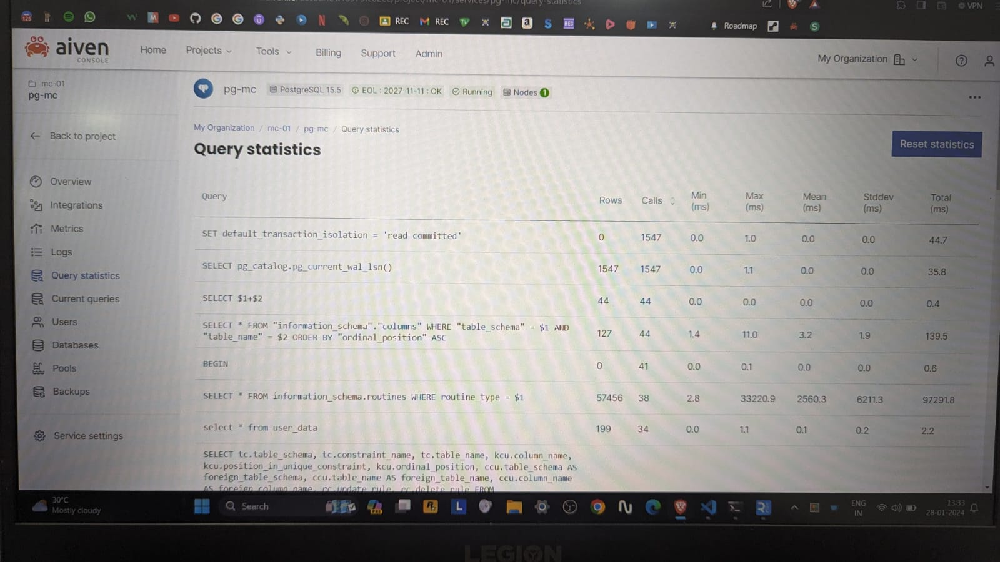
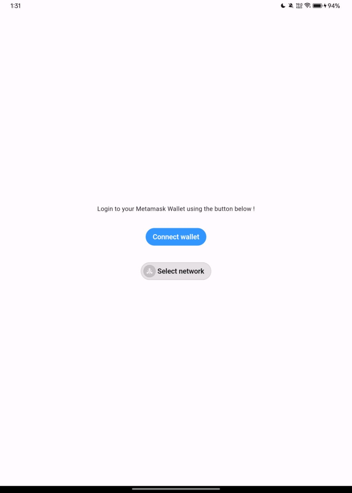
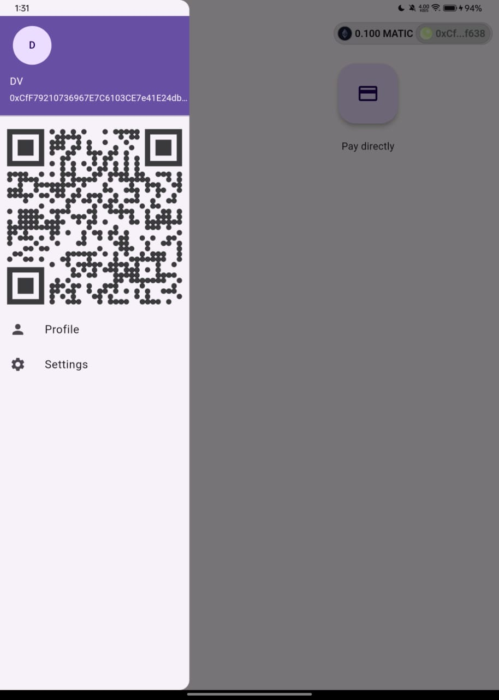

# How we almost made an centralised blockchain based universal currency during PECHACKS 2024

## We enter the hackathon

So my friend Noumaan approaches me and tells there is this hackathon in Panimalar college and wanted to go and had a spot left. I said "Okay". He wanted to do a project on blockchain. So, we decided on one. We decided to make a Paytm box but for cryptocurrencies. Initially we wanted to win the best hack on Etherium or Polygon. So we went with polygon. Since it is on polygon network and not a lot of people would use it. We might just win that(or that is how our though process was). 

## Project Abstract:

We wanted to bring the cryptocurrencies to the masses. So we questioned ourselves. What can we do to make it so common people and merchants would want to use it. Right from the start we knew we need to be backwards compatible with the current tech and we need somewhat physical device so they feel assurance that it is working. 

### Our great solution.

- A paytm like box. Speaker capable of connecting to the polygon network and use Test-To-Speech to read the latest transaction in your wallet id
- We wanted the users to convert their cryptocurrencies into  fiat currencies on the fly when making payments. Thus allowing integration upi and card payments. 

## Hour 0 

We all met up near the registration spot. There were 5 of us.
Dhruv, Noumaan, Dhanush, Me, Harish. The thing this is the first time we are meeting regarding the hackathon. Since we were very chill about the whole hackathon. We all had 0 coordination and didn't know what we were building in the first place. Partially because as mentioned in [solution](#our-great-solution). On looking back we did have a lot of meetings to make sure we were all on the same page but not everyone was there in those meetings. So pro tip for anyone who wants to do hackathons. Have regular meets. Make sure everyone knows what their role is. 

We quickly setup our laptops in our booths after registration. The college infrastructure was very good except the internet issues at the start of the event which made it near impossible for me to download any libraries or packages or docker container. 
Another pro tip. Install all the necessary libraries and packages before the hackathon. Don't waste your time there.

Since PECHACKS had a lot of sponsors which meant just for participating we walked away with a lot of free stuff.

We got a Thermo flask bottle which showed the temperature of the fluid on the side. Which was pretty cool.
And as you can see from the image. Stickers

## Hour 1 - 3

We decided on a tech stack and started to working.

### Problem 1.

Only one of us actually knew how to work with blockchain. 2 knew flutter. 2 were wild cards helping wherever needed. 

### Problem 2.

All the packages were either not we wanted or were deprecated or last updated 2 years ago.
The struggle was real we switched from one library to the other all the time. Couldn't get anything to work that satisfied our expectations.

## Hour 3 - 6

We were still trying out different libraries and ended up with [thirdweb](https://thirdweb.com/). It worked well for most of our use case.

## Hour 6 - 12

We got all the pieces we need and started hacking away to bring them together. Our flutter team were hard at work on making an awesome frontend. 
We were working away at making a mock bank api and api for our swift app.

## Hour 12 - 24 

You are probably thinking why haven't i explained about my app yet. The thing is this is the time in hackathon in which we were sure of what we were actually building.
So here is how it works

We had 2 databases ( don't ask me why ).
One for our mock Bank database hosted in Aiven. It was a postgres database
One for our swift app users. It was a mongodb cluster.
We made connections and had backend api ready in expressjs and python flask. 

So our application will talk with the bank api to do transactions.
At this point in time we had 2 api services running and 2 backend being built one for the web and one for the mobile using flutter. 

Everything going smooth we thought. We can win this we thought. Oh boy were we ever wrong.

## Hour 12 - 18

Misery strikes and it struck hard. We had a rasberrypi connected with a speaker and it didn't want to work at all. We had a websocket on our rasberrypi listening. Once it receives data from certain IP address it will then read out the transaction
it was perfect. Another services was created to talk with the rasberrypi. So number of services running were 4.
I still don't get how it happened or why but somehow the `pysttx3` the python package we were using for Test-To-Speech was behaving weirdly. When trying it out in the pi. It works flawlessly. Whenever we used the websocket the data is was reading couldn't be modified(not exactly).
If say `message` is the parameter of a function. We take the variable `message` do some operations on it and pass it the Test-To-Speech function but it worked with `print()` doesn't matter if you are using a different variable or copied the entire variable into a new one. It always spoke the original `message`.
example say `message` was "65.000" and we wanted it to be "65". Whatever we did to convert it into "65" would work and print out in `print()` either say turning it into `int` or using string operations but when the goes to Test-To-Speech. it would say "65.000"

Then the another problem was we couldn't figure out why our code wasn't working we named the Test-To-Speech file `ttl.py` it might have had some other python file in the same name in the path i guess (not in the same directory though).

Once we resolved these issues by changing the `ttl.py` to `speaker.py` and black magic (BigInt number system in javascript problem) we moved onto other problems

At this point in time. The blockchain smart contracts was in a great state and all that there was to do was work on api integration and frontend. It was a stupid thought that it was easy.

## Hour 18 - 24

We were bombarded with errors. The flutter team couldn't get needed packages to work. we pivoted to making it work via the server backend. How you ask ?
Thats where the title comes into play. How we almost made a centralised cryptocurrency. We decided all the secret keys for the user metamasks should be stored in swift db (mongodb)(obviously hashed duh)(not really...).
So we can do transactions on their behalfs. Since we were doing conversion from the coin we made in polygon to fiat on the fly. we needed the transactions and conversion rate to be done in the backend.

## Hour 24 - 30

The bulk of the work was already done. We somehow patched together enough. To have a prototype to showcase. The user flow was
User Enters Metamask -> Selected our coin -> logins to our app -> scans a qr code (could be upi or wallet id) -> makes payment either in crypto or inr either this to that

So we had 4 types of transactions. Since our token was called as MCT(polygon tokens) and fiat currency was called as MCR(say ruppees)

1. MCT - MCT entirely on the blockchain 
2. MCT - MCR our wallet id will get the MCT from user and our bank will send the equivalent MCR to the receiver.
3. MCR - MCT user will pay our bank and equivalent MCT will be sent to the receiver
4. MCR - MCR bank to bank transfer

All these were successfully implemented and was working.
And when the transaction occurs in merchants wallet id. It will be read by the rasberrypi speaker.

## Hour 30 - 36

We were all burnt out and were exhausted. The frontend wasn't working on the web as expected. We just had the frontend in android. 
Overall we gave it our best

Some screenshots of our project

## Content provided by flutter team

The Flutter team was entrusted with only the Metamask login and they were made to believe that all the other apis will be provided on demand. So they started off with searching resources with integrating the Metamask login in our app. Although there were plenty of packages available, majority of them were only supported for the web and were useless to us as our app was centered for Mobile platforms only. After 4 - 5 hours of painful grinding, they found a package that took care of the metamask login by itself and now they required only the APIs. When they were able to do this, it was only logical to try out to carry crypto transactions keeping the metamask as the mediator. But that package was not supportive of all the functions for carrying out such transactions. After a 5 hours of futile efforts, we came to a conclusion to carry out the transactions at the backend, with the Flutter frontend only requiring to create users for our app and login. After successful users management, we made a list of checkpoints for our app as follows: Login, Register, Scan QR, Initiate transactions, Process them at the backend, and display the result of success or failure. We completed the checkpoints one after the other and after our app was fully functional, we made our UI more attractive and responsive. That way, our app was ready for demonstration and we displayed our app to the juries with all the use cases and scenarios of transactions mentioned before.

# Conclusion

Even though we didn't win. We learnt a lot and most importantly we enjoyed a lot. The MLH workshops were interesting. The prizes were crazy. Got a lot of free stuff that would be the 1st prize in our college 🤣.
Learnt a great deal about blockchain and rules surrounding it in various countries.
What is limiting its growth. How governments are against it and why. How they are taxed.
We were quite happy with the results. Cause by the end of the event we had a working app with all the intended features we planned.

# Project repos

- [backend](https://github.com/Raxen001/new_rec_companion_app)
- [frontend](https://github.com/dhruvrjain/crypto_swift)

