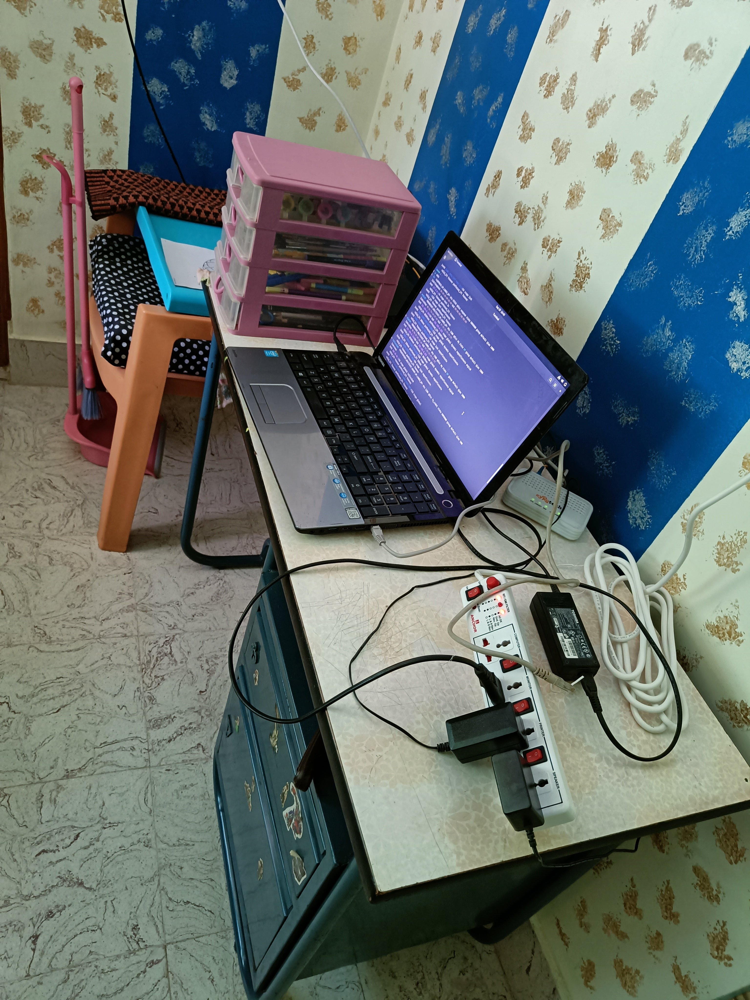

# Home media server

I was bored and wanted to created my own personal netflix at home. So, naturally i wanted some kind of hardware that can run a media server
Fortunately, I had a spare laptop lying around a toshiba .

## specs


Not too shabby if i say so myself.

## STEP 0

### OS of choice

Nowadays we have gotten a lot of options for installing an operating system that is server ready and usable to the user.
meaning i have gottent a lot of options. I have experience running a Arch linux system for the past 2 years and Fedora system
for about 6 months. I only ever used a debian based distro when i was dipping my toes into linux and that was about 3.5 years back
So, i decided why not try [Debian 12](https://debian.org) (book work).
Everyone priased it as a rock solid distro with amazing performance and stability.

## STEP 1

### DOWNLOADING OS

I went with the torrent download of the _ISO_ file. Since, it will be faster. I chose the netinstaller cause i couldn't find the normal one or there wasn't one idk.
Netinstaller worked well in my case as the internet in my home good enough that most the software it needed to download didn't take long. It may not be suitable for
someone living in a slow internet location.

### FLASHING OS

You need to flash the usb stick with the os of your choice.

It was fairly straightforward all you ever need to install a linux distro is usb stick that is ideally above 4gb of storage capacity.
You can use _rufus_ or media creation tool of your choice.

For Linux users you have a lot of choice you can do something like
`dd if=debian.iso of=/dev/sdb bs=4M status=progress` **i made it up from memory don't copy paste**
or use the `cat` command or use media creation tool already present in your Operating System if your running a normie distro.

#### RECOMMENDED

I chose to go with [ventoy](https://www.ventoy.net) it is awesome as it allows me to have multiple linux distros in a same usb.
It is as simple as setting up ventoy in the usb and then dragging and dropping your ISOs into the Ventoy folder.
**HIGHLY RECOMMENDED\***

Once the usb is flashed properly now we need to boot from it

### BOOTING

Booting from the usb is fairly simple.
While booting you simply have to hold down the button that makes it go into the UEFI / BIOS menu.
It was _F2_ for me.
Once insde the UEFI menu [UEFI_MENU](../uefi_menu.jpg) go to

In boot menu

- navigate to SECURITY TAB and **Disable** _SECURE BOOT_
- Optionally Change Boot order so USB comes first

At this point i had keyboard issues. A lot of keys in the laptop stopped working.
So, i had to improvise. **Numpad arrow right** and **Numpad arrow up** worked. **Left arrow** and **Down arrow** Worked. **F2** worked

I had to go to windows and press _SHIFT_ and restart to go into Boot Menu.
These workarounds are specific to the laptop i had. Your case may vary.

Select the OS you want to install from USB.

## STEP 2

### INSTALLING OS

I am gonna skip all the steps here. it is pretty straightforward.
The installation wizards will ask you stuff and you have to click a few buttons.

## STEP 3

### Installing DOCKER

What is docker ?

Docker is a containerization platform unlike virtual machines where all the components of the system are simulated. Here the host kernel is used by the container.
Long story short. Virtual machines have performance hit. Docker not so much. Makes it ideal for my old laptop.

## Installing Tailscale

I wanted to access my machine even when i was out of the house. So, you can either use
port forwarding to acces it from anywhere which was impossible as my ISP has CGNAT or Double NAT.
So, i decided go with [Tailscale](https://tailscale.com) an atlernative was zerotier. But i didn't know what the differece was
so i went with tailscale. Basically it creates a mesh network where an extra network card showd up in your machince and you can access your remote devices as if they were present in your localmachine

```bash
4: tailscale0: <POINTOPOINT,MULTICAST,NOARP,UP,LOWER_UP> mtu 1280 qdisc fq_codel state UNKNOWN group default qlen 500
    link/none
    inet 100.117.79.111/32 scope global tailscale0
       valid_lft forever preferred_lft forever
    inet6 fd7a:115c:a1e0:ab12:4843:cd96:6275:4f6f/128 scope global
       valid_lft forever preferred_lft forever
    inet6 fe80::9c38:ed45:1929:4ec/64 scope link stable-privacy
       valid_lft forever preferred_lft forever
```

It is pretty easy to setup.

### SIGN UP TO TAILSCALE

Login in to your tailscale account Or create a new one.

### Click on add devices.

Follow the steps.
in my case since i am using Debian it was

```
curl -fsSL https://pkgs.tailscale.com/stable/debian/bookworm.noarmor.gpg | sudo tee /usr/share/keyrings/tailscale-archive-keyring.gpg >/dev/null
curl -fsSL https://pkgs.tailscale.com/stable/debian/bookworm.tailscale-keyring.list | sudo tee /etc/apt/sources.list.d/tailscale.list
sudo apt-get update
sudo apt-get install tailscale
sudo tailscale up
```

Once installing gets completed an url will pop. Navigate to that url and sign in.
And you are done

### DONE

Now you can access your devices from anywhere.
Since, it is a mesh network. There is to data limit. as Data isn't going through Tailscale servers.
They only helping in making the mesh network.

# NOTES

installing everything using a single docker compose file
script to make it so i can be reproducible everywhere
